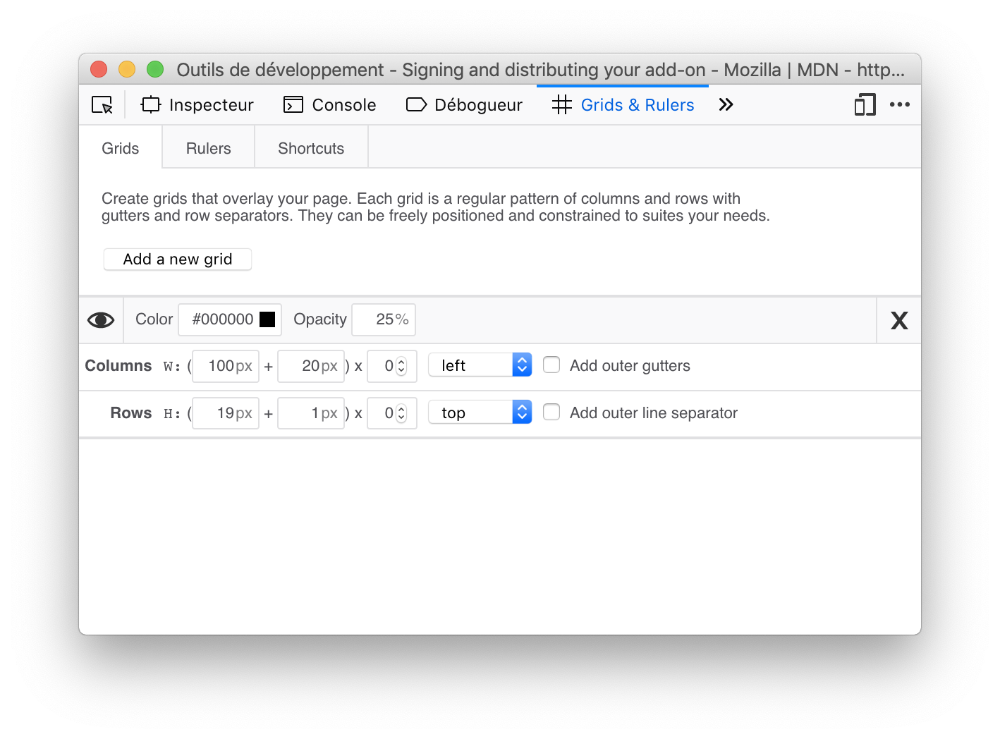
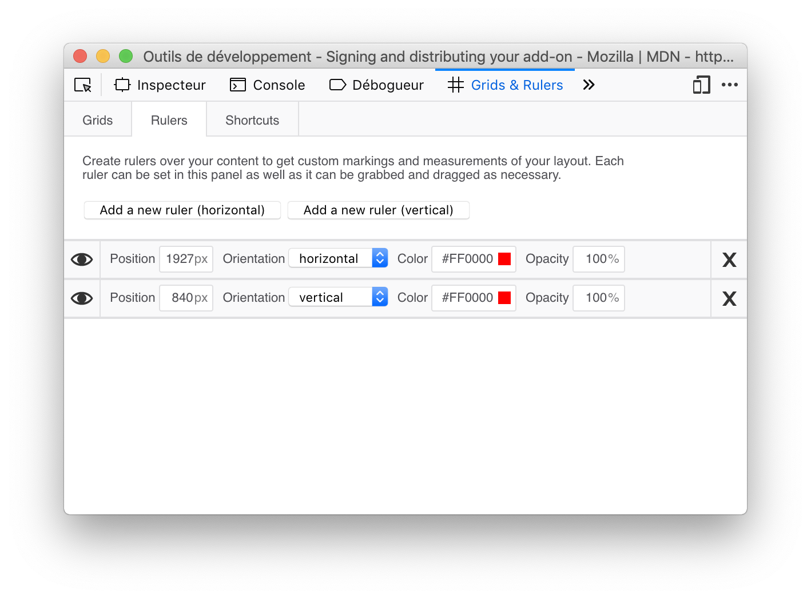
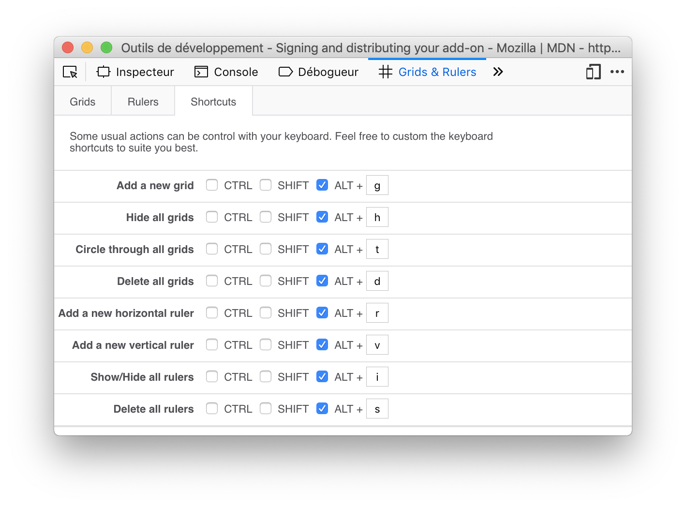

Grids & Rulers
===============================================================================

**Grids & Ruler** is a Web Extension that add a new panel to Firefox and Chrome developer tools. That panel let you create overlays on pages to let you have visual hints to develop you web app layouts.

Install those extensions directly from the appropriate marketplaces:

- [Firefox Add-ons](https://addons.mozilla.org/fr/firefox/addon/grids-rulers/)
- [Chrome extensions](https://chrome.google.com/webstore/detail/grids-rulers/kaippllfihpjicemabbbcljbmcpccabl)

## Grids

Grid are regular patterns of columns and rows with gutters and row separators. They can be freely positioned and constrained to suites your needs.

## Rulers

Rulers are custom markings that let you measure your layout. Each ruler can be set in the panel as well as it can be grabbed and dragged on the content page as necessary.

## Keyboard shortcut

Some common action can be controled through keyboard shorcuts. Those actions are:

 - `Alt+g` : Create a new grid
 - `Alt+h` : Hide all grids
 - `Alt+t` : Circle through (toggle) all grids,
 - `Alt+d` : Delete all grids,
 - `Alt+r` : Create a new horizontal ruler
 - `Alt+v` : Create a new vertical ruler
 - `Alt+i` : Show/Hide all rulers
 - `Alt+s` : Delete all rulers

Such keyboard shortcuts can be customized to suite your needs.

