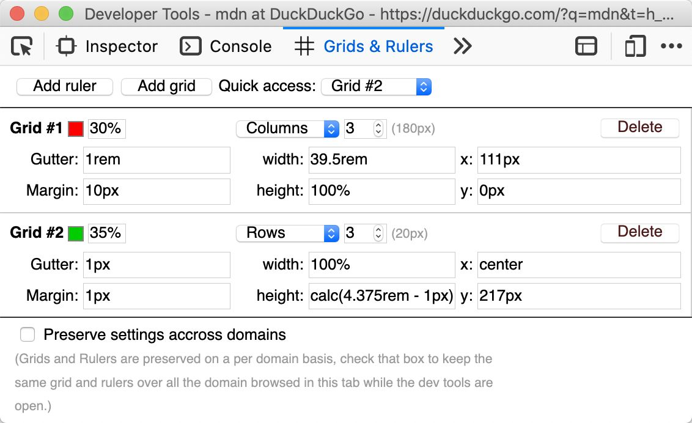
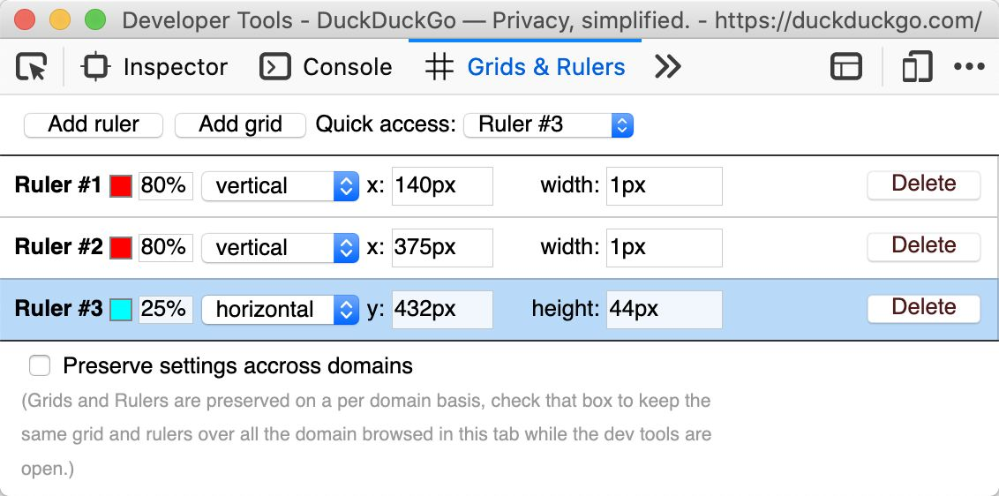

Grids & Rulers
===============================================================================

**Grids & Ruler** is a Web Extension that add a new panel to Firefox and Chrome
developer tools. That panel let you create overlays on pages to let you have
visual hints to develop you web app layouts.

Install the extension directly from the appropriate marketplaces:

- [Firefox Add-ons](https://addons.mozilla.org/fr/firefox/addon/grids-rulers/)
- [Chrome extensions](https://chrome.google.com/webstore/detail/grids-rulers/kaippllfihpjicemabbbcljbmcpccabl)

## Grids

Grid are regular patterns of columns or rows with separators (gutters). They
can be freely positioned and constrained to suites your needs.

## Rulers

Rulers are custom markings that let you measure your layout. Each ruler can be
set in the panel as well as it can be grabbed and dragged on the content page
as necessary.

## Change in version 2.0

The extension has been fully rewritten to provide a more compact and flexible
UI as well as the following new features and bug fixes:

 * Fix [#1](/JeremiePat/grids-and-rulers/issues/1) : Grid definition is more
   bootstrap compatible (if you want different ways to define a grid feel free
   to open an issue).
 * Fix [#2](/JeremiePat/grids-and-rulers/issues/2) : All length can be express
   in any CSS units and `calc()` is also allowed (be careful with relative
   units as they are only resolved against the body sizes).
 * Fix [#3](/JeremiePat/grids-and-rulers/issues/3) : Grid are now fully
   persistent on a per domain basis, they'll appear each time you'll open the
   devtools (and disappear each time you'll close them).
 * Remove keyboard shortcuts as they were too buggy and not that useful (open
   an issue if you want them back).
 * Improve UI accessibility (It can now be fully operated with the keyboard).
